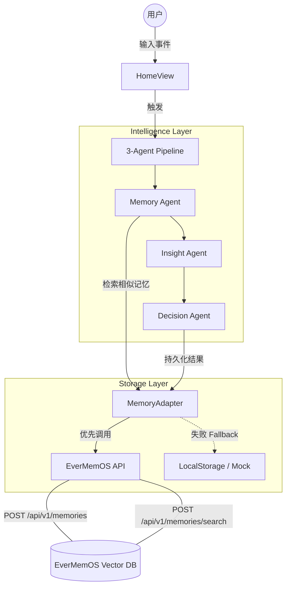

# WhatIf - EverMemOS 决策陪伴系统

> **Hackathon Edition: 长期记忆 + 多 Agent 决策陪伴**

WhatIf 是一款基于 **EverMemOS** 理念开发的个人决策复盘与人生推演系统。它不仅仅是一个日记或聊天机器人，而是一个能够识别你人生“棋局”中重复模式、提供深层洞察并辅助决策的智能伙伴。

## 🌟 核心理念

在人生的棋局中，未解决的问题往往会以不同的形式重复出现。WhatIf 通过接入 EverMemOS 的长期记忆能力，帮助用户：
1. **识别惯性**：通过 Memory Agent 发现跨越数年的行为模式。
2. **深度释怀**：通过 Insight Agent 剖析情绪背后的深层诉求与他人动机。
3. **科学决策**：通过 Decision Agent 进行 What-if 推演，权衡长短期收益。

## 🤖 3-Agent 协作流水线

项目核心实现了一个自动化的 3-Agent 协作流，确保每一个记录的事件都能得到深度处理：

1. **Memory Agent**：
   - **驱动逻辑**：当用户输入新事件时，Memory Agent 会调用 `memoryAdapter.searchSimilar`。
   - **记忆召回**：它会从 EverMemOS 中检索相似的历史记忆，作为后续 Insight 和 Decision 的上下文。
   - **模式识别**：基于召回的记忆，识别当前事件是否属于某种“重复模式”。

2. **Insight Agent**：分析情绪光谱，挖掘深层诉求，提供第三方视角洞察。
3. **Decision Agent**：开启平行时空推演，生成行动指南与触发提醒。

## 🛠️ 技术架构



## 🔗 EverMemOS 真实接入状态

### 1. 当前真实接入 API
- **存储记忆 (`POST /api/v1/memories`)**: 
  - **触发点**：用户保存新事件，以及 3-Agent 流水线生成最终决策结果时。
  - **作用**：将结构化的决策过程持久化到 EverMemOS 的向量数据库中。
- **检索记忆 (`POST /api/v1/memories/search`)**: 
  - **触发点**：Memory Agent 运行阶段。
  - **作用**：基于当前事件内容，在 EverMemOS 中进行语义搜索，召回最相关的历史经验。

### 2. 真实 API / Fallback 边界
- **在线模式**：若本地已启动 EverMemOS 服务（默认 `http://localhost:8000`），系统将实现真正的跨会话长期记忆召回。
- **离线/Fallback 模式**：若服务不可用，系统自动切回 `localStorage`。此时仅支持当前浏览器的本地存储，且检索逻辑退化为简单的关键词匹配。

## 🚀 本地运行步骤

### 1. 启动 EverMemOS (后端)
请参考 [EverMemOS 官方仓库](https://github.com/EverMind-AI/EverMemOS) 进行部署：
```bash
git clone https://github.com/EverMind-AI/EverMemOS.git
cd EverMemOS
pip install -r requirements.txt
python main.py --port 8000
```

### 2. 启动 WhatIf (前端)
```bash
# 克隆本项目
git clone https://github.com/MyraWang0406/EverMemOS-draft.git
cd EverMemOS-draft

# 配置环境变量 (可选，默认已指向 localhost:8000)
# cp .env.example .env

# 安装依赖并启动
pnpm install
pnpm run dev
```

## 🎬 Demo 视频脚本 (3-5 分钟)

- **[0:00-0:45] 场景引入**：
  - *画面*：展示用户在深夜记录一段关于“职场晋升受阻”的焦虑文字。
  - *旁白*：你是否觉得，生活中的某些难题总是在重复？同样的沟通障碍，同样的决策纠结。
- **[0:45-1:30] 记忆召回 (EverMemOS 介入)**：
  - *画面*：点击“开始推演”，展示 Memory Agent 正在从 EverMemOS 检索。
  - *旁白*：WhatIf 接入了 EverMemOS 长期记忆。它瞬间从你两年前的记录中，找到了极其相似的场景。
- **[1:30-2:30] 深度洞察 (Insight Agent)**：
  - *画面*：展示情绪光谱分析，高亮显示“渴望认可”和“防御性反应”。
  - *旁白*：Insight Agent 剖析了冰山底部的动机。原来，你的焦虑并非源于能力，而是源于一种长期的“被边缘化”恐惧。
- **[2:30-3:30] 决策推演 (Decision Agent)**：
  - *画面*：展示 What-if 平行时空对比，一边是“继续隐忍”，一边是“主动沟通”。
  - *旁白*：Decision Agent 为你推演了不同选择的长期影响，并给出了具体的行动指南和触发提醒。
- **[3:30-4:00] 总结结尾**：
  - *画面*：展示“人生棋局”看板，所有记忆点连成线。
  - *旁白*：未解决的问题会重复出现，直到你给出新的答案。WhatIf + EverMemOS，让每一份记忆都成为决策的基石。

---

*Built for Hackathon 2026 - 让每一份记忆都成为决策的基石。*
